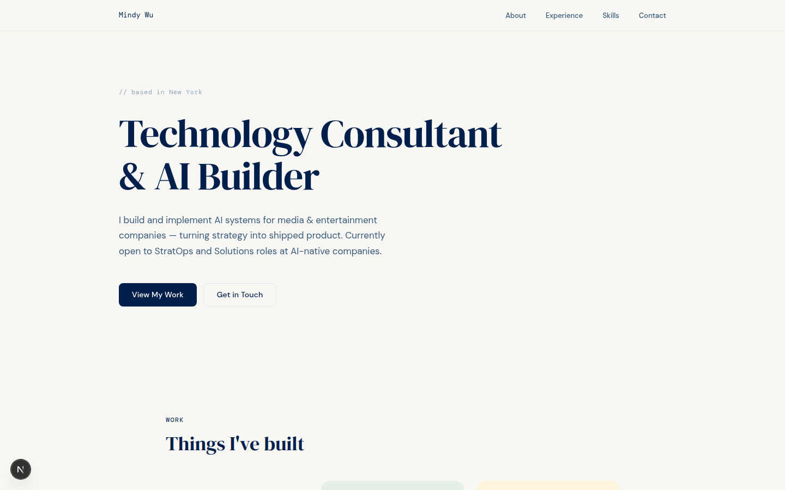
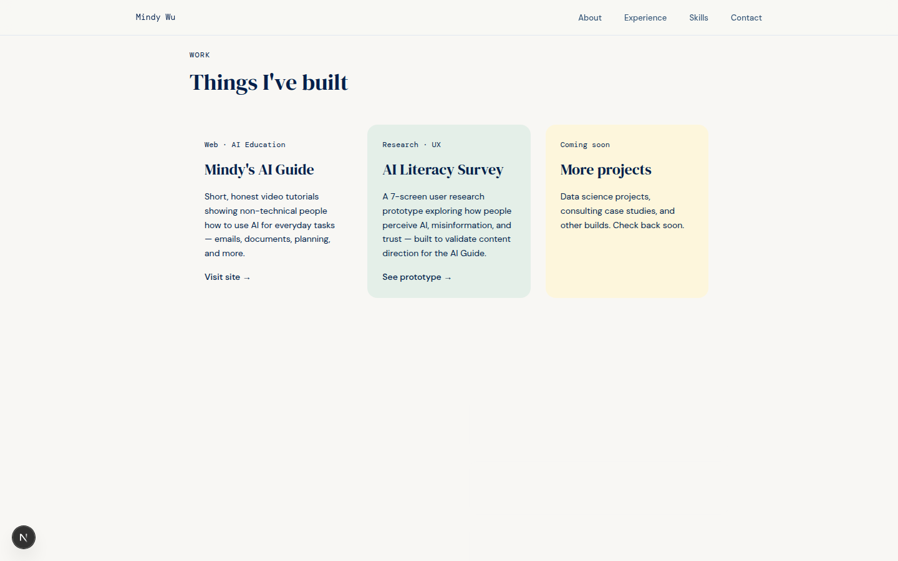

# Mindy Wu — Portfolio

Personal portfolio site for Mindy Wu, a technology consultant and AI builder based in New York. It's a single-page site covering what I've built, who I am, and how to reach me, and it links out to my other projects like [Mindy's AI Guide](https://mindys-ai-guide.vercel.app).

**Live site:** [mindy-portfolio.vercel.app](https://mindy-portfolio.vercel.app)

## Screenshots





## Tech stack

- [Next.js 16](https://nextjs.org) (App Router) with React 19
- TypeScript
- Tailwind CSS 4
- DM Serif Display, DM Sans, and DM Mono loaded through `next/font`
- Deployed on Vercel

## Features

- Single-page layout with smooth-scroll navigation
- Editorial type system: serif display headings, sans body text, monospaced accents
- Staggered fade-up entrance animations
- Project cards linking to live work

## Why I built it

I wanted one place that shows what I actually do — consulting work on enterprise AI deployments and side projects that make AI approachable for non-technical people. Building it was also a chance to work hands-on with the current Next.js App Router and Tailwind 4.

Built with [Claude Code](https://claude.com/claude-code).

## Running locally

```bash
npm install
npm run dev
```

Then open [http://localhost:3000](http://localhost:3000).
